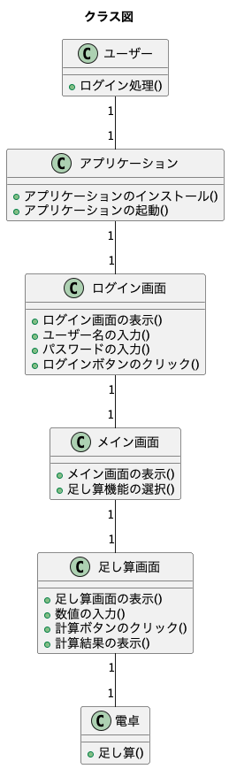
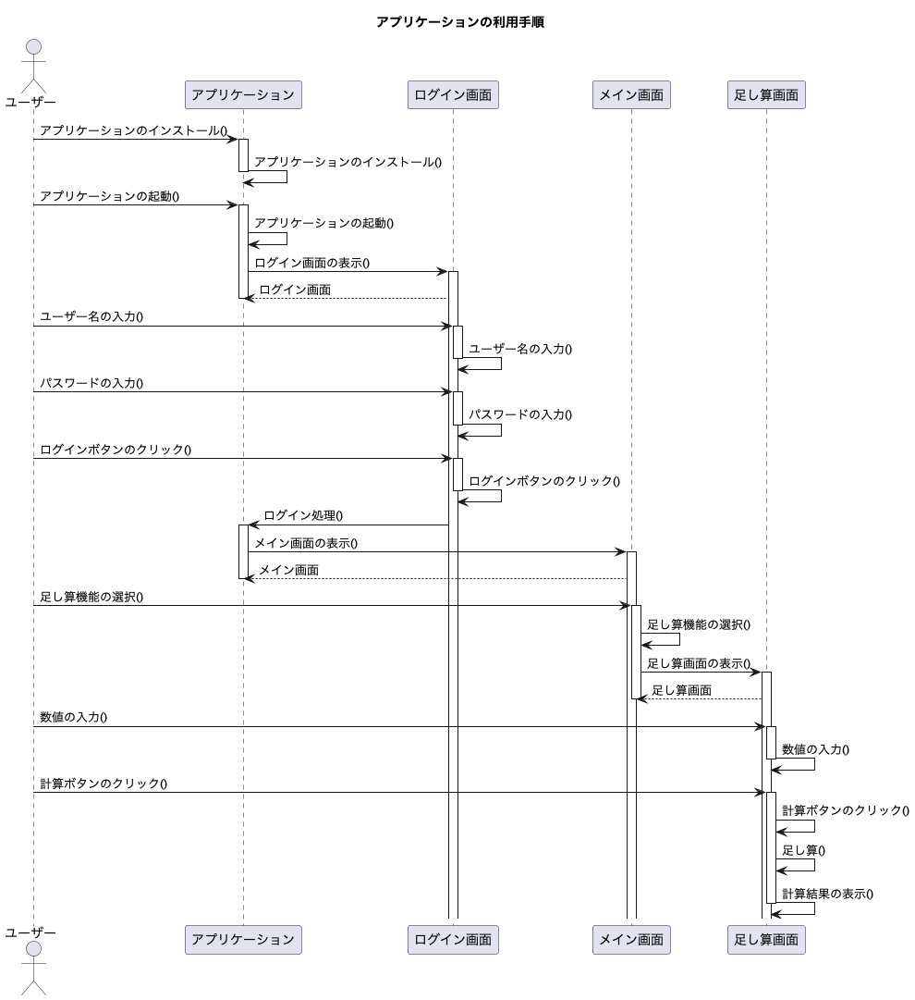

# 引用
- `ログイン画面` = swift [./画面/ログイン画面]
- `メイン画面` = swift [./画面/メイン画面]
- `足し算画面` = swift [./画面/足し算画面]
- `足し算` = py [./ユーティリティ/数学/電卓].足し算
- `ログイン処理` = go [./API/認証/ユーザー].ログイン
- `インストール` = md [./ドキュメント/チュートリアル].インストール
- `アプリケーションのインストール` = swift [./アプリケーション].インストール
- `アプリケーションの起動` = swift [./アプリケーション].起動
- `ログイン画面の表示` = swift [./画面/ログイン画面.表示]
- `ユーザー名の入力` = swift [./画面/ログイン画面.ユーザー名入力]
- `パスワードの入力` = swift [./画面/ログイン画面.パスワード入力]
- `ログインボタンのクリック` = swift [./画面/ログイン画面.ログインボタンクリック]
- `メイン画面の表示` = swift [./画面/メイン画面.表示]
- `足し算機能の選択` = swift [./画面/メイン画面.足し算機能選択]
- `足し算画面の表示` = swift [./画面/足し算画面.表示]
- `数値の入力` = swift [./画面/足し算画面.数値入力]
- `計算ボタンのクリック` = swift [./画面/足し算画面.計算ボタンクリック]
- `計算結果の表示` = swift [./画面/足し算画面.計算結果表示]

- `ログイン画面`                 = [./画面/ログイン画面.swift]
- `メイン画面`                   = [./画面/メイン画面.swift]
- `足し算画面`                   = [./画面/足し算画面.swift]
- `足し算`                      = [./ユーティリティ/数学/電卓.py].足し算
- `ログイン処理`                 = [./API/認証/ユーザー.go].ログイン
- `インストール`                 = [./ドキュメント/チュートリアル.md].インストール
- `アプリケーションのインストール`  = [./アプリケーション.swift].インストール
- `アプリケーションの起動`         = [./アプリケーション.swift].起動
- `ログイン画面の表示`            = [./画面/ログイン画面.swift].表示
- `ユーザー名の入力`              = [./画面/ログイン画面.swift].ユーザー名入力
- `パスワードの入力`              = [./画面/ログイン画面.swift].パスワード入力
- `ログインボタンのクリック`       = [./画面/ログイン画面.swift].ログインボタンクリック
- `メイン画面の表示`              = [./画面/メイン画面.swift].表示
- `足し算機能の選択`              = [./画面/メイン画面.swift].足し算機能選択
- `足し算画面の表示`              = [./画面/足し算画面.swift].表示
- `数値の入力`                   = [./画面/足し算画面.swift].数値入力
- `計算ボタンのクリック`           = [./画面/足し算画面.swift].計算ボタンクリック
- `計算結果の表示`               = [./画面/足し算画面.swift].計算結果表示

- `ログイン画面`                 = [./画面/ログイン画面].swift
- `メイン画面`                   = [./画面/メイン画面].swift  
- `足し算画面`                   = [./画面/足し算画面].swift
- `足し算`                      = [./ユーティリティ/数学/電卓.py]
- `ログイン処理`                 = [./API/認証/ユーザー.go]
- `インストール`                 = [./ドキュメント/チュートリアル.md]
- `アプリケーションのインストール`  = [./アプリケーション].swift
- `アプリケーションの起動`         = [./アプリケーション].swift
- `ログイン画面の表示`            = [./画面/ログイン画面].表示
- `ユーザー名の入力`              = [./画面/ログイン画面].ユーザー名入力
- `パスワードの入力`              = [./画面/ログイン画面].パスワード入力
- `ログインボタンのクリック`       = [./画面/ログイン画面].ログインボタンクリック
- `メイン画面の表示`              = [./画面/メイン画面].表示
- `足し算機能の選択`              = [./画面/メイン画面].足し算機能選択
- `足し算画面の表示`              = [./画面/足し算画面].表示
- `数値の入力`                   = [./画面/足し算画面].数値入力
- `計算ボタンのクリック`           = [./画面/足し算画面].計算ボタンクリック
- `計算結果の表示`               = [./画面/足し算画面].計算結果表示

# アプリケーションの利用手順

## 概要

このドキュメントでは、アプリケーションの利用手順について説明します。以下の手順に従って、アプリケーションを`インストール`し、`ログイン処理`を行い、`足し算`機能を使用します。

## 手順

1. アプリケーションの`インストール`

- アプリケーションをデバイスにダウンロードして`アプリケーションのインストール`を行います。

- `アプリケーションのインストール`が完了したら、`アプリケーションの起動`を行います。

2. `ログイン処理`

- `アプリケーションの起動`後、`ログイン画面`の`ログイン画面の表示`が行われます。

- `ログイン画面`で`ユーザー名の入力`と`パスワードの入力`を行い、`ログインボタンのクリック`を行います。

- `ログイン処理`が成功すると、`メイン画面`の`メイン画面の表示`に遷移します。

3. `足し算`機能の使用

- `メイン画面`の`メイン画面の表示`で、`足し算機能の選択`を行います。

- `足し算画面`の`足し算画面の表示`が行われ、2つの`数値の入力`を行います。

- `計算ボタンのクリック`を行うと、`足し算`が実行され、`計算結果の表示`が行われます。

# シーケンス図

<!-- 

# クラス図 -->

