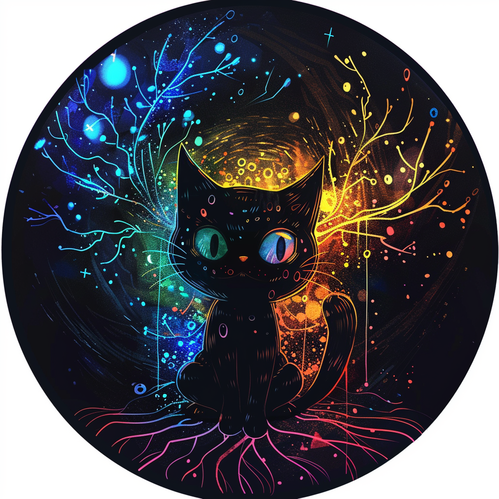

以下に、`表の定義`に従って、`image`および`mov`の情報をまとめたMarkdown形式の表を作成しました。また、全体を整理整頓した際のディレクトリ・ファイルの構成をTree形式で記載しました。

### 画像と動画の表

| 大分類 | 中分類 | メディア属性 | タイトル | 概要 | 詳細 | リンク |
| --- | --- | --- | --- | --- | --- | --- |
| 画像 | グラフ | 画像 | 累積ダウンロード数のグラフ | 累積ダウンロード数の増加を示す折れ線グラフ | グラフは2024年5月23日から5月13日までの日付を横軸に取り、縦軸には累積ダウンロード数が表示されています。 | [](./cumulative_downloads.png) |
| 画像 | ファンタジー | 画像 | 美しい女性魔法使い | 筆を使って本に何かを書いている女性 | 魔法のエフェクトのようなカラフルな光が筆先から発せられている | [](./dai4697_A_beautiful_female_wizard_dressed_in_sophisticated_fash_38f8dedb-cdca-41ed-9136-e3eb0ec864b7.png) |
| 画像 | ファンタジー | 画像 | 古い巻物 | 古い巻物に星や幾何学模様が描かれている | 様々な記号や文字が見られ、巻物の縁は少し破れている | [](./dai4697_A_job_posting_written_in_crystal_ink_on_an_old_parchmen_a6706f0f-5035-487e-9d77-b8a219e57979.png) |
| 画像 | ファンタジー | 画像 | 巨大な掲示板 | 多くの人々が集まっているシーン | 古い書類や地図が貼られた巨大な掲示板の前に立っている | [](./dai4697_A_large_horizontal_wooden_notice_board_dominates_the_ce_ddb81d47-7f41-408c-a8e6-ec1c5cf2211f.png) |
| 画像 | ファンタジー | 画像 | 魔法使いと魔法の書 | 魔法使いが魔法の書を開いている様子 | フード付きのローブを着た人物が手から魔法のエネルギーを放っている | [](./dai4697_A_powerful_wizard_conjuring_a_book_out_of_thin_air_magi_8e71d9c5-1313-467f-a9d6-1a1ff771be0a.png) |
| 画像 | キャラクター | 画像 | GitHubのOctocat | 黒い猫が中央に描かれている | 背景にはカラフルな色合いの枝状の模様が広がっている | [](./dai4697_GitHubs_Octocat_using_the_gh_command_to_generate_issues_a89738b2-0d9f-4ea3-8706-9d84b308b87a.png) |
| 画像 | ファンタジー | 画像 | デスク上のアイテム | 古いデスクの上に様々なアイテムが置かれている | 本、インク壺、羽ペン、懐中時計、ランプなどが見える | [](./dai4697_Harry_Potters_elder_wand_lies_on_a_desk_b79d0384-436a-4424-899f-4bc76b4c155a.png) |
| 画像 | 自然 | 画像 | 緑豊かな森 | 光が差し込む中を歩く人々 | 木々や植物が生い茂り、葉っぱの間から明るい日差しが差し込んでいる | [](./dai4697_Vibrant_green_summer_educational_institute_advertisemen_1d66b15c-426a-4b65-a917-66a5bcc0a3ca.png) |
| 画像 | ダイアグラム | 画像 | シーケンス図 | アプリケーションの利用手順を示すシーケンス図 | ユーザーがアプリケーションを使用する際の流れを詳細に描いている | [](./sequence_diagram.png) |
| 画像 | ダイアグラム | 画像 | クラス図 | オブジェクト指向プログラム設計のクラス図 | クラス間の関係と機能を視覚的に表現している | [](./sequence_diagram_001.png) |
| 動画 | デモ | 動画 | ChatGPT-4の機能デモ | ChatGPT-4の機能とユーザーインターフェースのデモ | 様々な機能とその利用例を紹介している | [](./gpt4o.mov) |

### ディレクトリ・ファイル構成

以下は、全体を整理整頓した際のディレクトリ・ファイルの構成です。

```plaintext
├── images
│   ├── cumulative_downloads.png
│   ├── dai4697_A_beautiful_female_wizard_dressed_in_sophisticated_fash_38f8dedb-cdca-41ed-9136-e3eb0ec864b7.png
│   ├── dai4697_A_job_posting_written_in_crystal_ink_on_an_old_parchmen_a6706f0f-5035-487e-9d77-b8a219e57979.png
│   ├── dai4697_A_large_horizontal_wooden_notice_board_dominates_the_ce_ddb81d47-7f41-408c-a8e6-ec1c5cf2211f.png
│   ├── dai4697_A_powerful_wizard_conjuring_a_book_out_of_thin_air_magi_8e71d9c5-1313-467f-a9d6-1a1ff771be0a.png
│   ├── dai4697_GitHubs_Octocat_using_the_gh_command_to_generate_issues_a89738b2-0d9f-4ea3-8706-9d84b308b87a.png
│   ├── dai4697_Harry_Potters_elder_wand_lies_on_a_desk_b79d0384-436a-4424-899f-4bc76b4c155a.png
│   ├── dai4697_Vibrant_green_summer_educational_institute_advertisemen_1d66b15c-426a-4b65-a917-66a5bcc0a3ca.png
│   ├── sequence_diagram.png
│   └── sequence_diagram_001.png
├── videos
│   └── gpt4o.mov
└── table_definition.md
```

この構成により、画像ファイルと動画ファイルがそれぞれ`images`と`videos`ディレクトリに整理され、`table_definition.md`ファイルがルートディレクトリに配置されることになります。