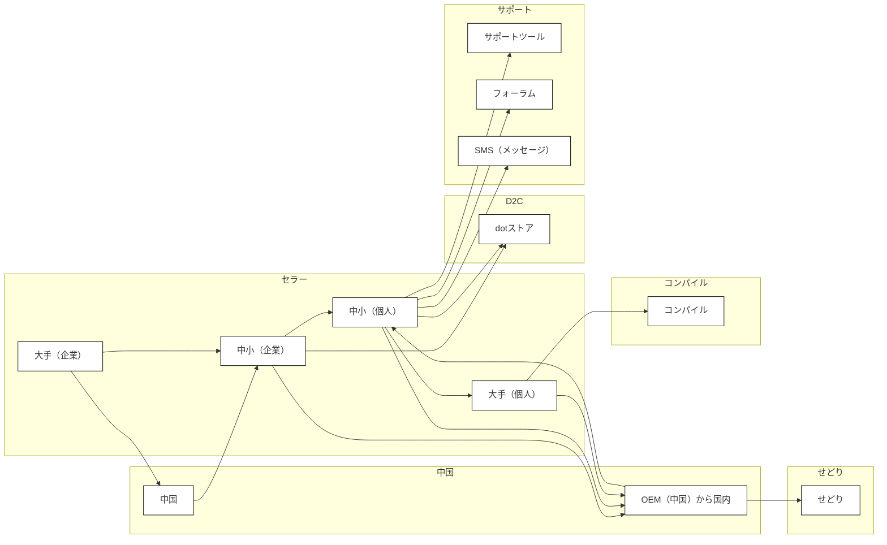

## ビジネスエコシステムの関係性

### 2次元関係図

### シーケンス図

::: mermaid
sequenceDiagram
  participant セラー
  participant 大手（企業）
  participant 中小（企業）
  participant D2C
  participant dotストア
  participant 中小（個人）
  participant 大手（個人）
  participant 中国
  participant OEM

  activate セラー
  セラー->>+大手（企業）: 依存
  大手（企業）->>+中小（企業）: 依存
  deactivate 大手（企業）
  中小（企業）->>D2C: 接続
  中小（企業）->>dotストア: 接続
  中小（企業）->>+中小（個人）: 依存
  deactivate 中小（企業）
  中小（個人）->>+大手（個人）: 接続
  中小（個人）->>+中国: 依存（SMS, サタデイ）
  中国->>-中小（個人）: 依存
  中国->>+OEM: OEM供給
  OEM->>-国内: 供給
  deactivate 中小（個人）
  deactivate 大手（個人）
  deactivate セラー
:::
### 表

| 大分類 | 小分類 | 説明 |
|---|---|---|
| セラー | 大手（企業） | 中小企業に依存 |
|  | 中小（企業） | 大手企業、D2C、dotストア、中小個人に接続 |
|  |  | 大手企業から依存 |
| 消費者 | D2C | 中小企業と接続 |
|  | dotストア | 中小企業と接続 |
| 個人 | 中小（個人） | 中小企業、大手個人、中国に接続 |
|  |  | 中小企業から依存 |
|  | 大手（個人） | 中小個人と接続 |
|  |  | OEM中間供給との関係 |
| その他 | 中国 | 中小個人に依存 |
|  |  | OEMとの関連性 |
|  | OEM | 中国から国内へのOEM供給 |

## 解説

上記の図と表は、あるビジネスエコシステムにおける企業、個人、そして中国の関係性を示しています。

**2次元関係図**は、各要素間の依存関係と接続関係を視覚的に表現しています。矢印の方向は依存関係の方向を示し、サブグラフは特定のグループをまとめるために使用されています。

**シーケンス図**は、各要素間の相互作用を時系列で示しています。これにより、ビジネスプロセスや情報の流れを理解することができます。

**表**は、各要素を大分類、小分類、説明に分けて整理しています。これにより、各要素の役割や関係性をより詳細に把握することができます。

これらの図と表を組み合わせることで、複雑なビジネスエコシステムを多角的に分析することができます。
